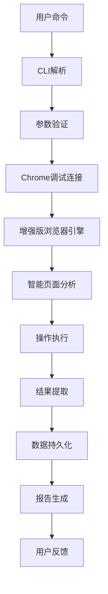
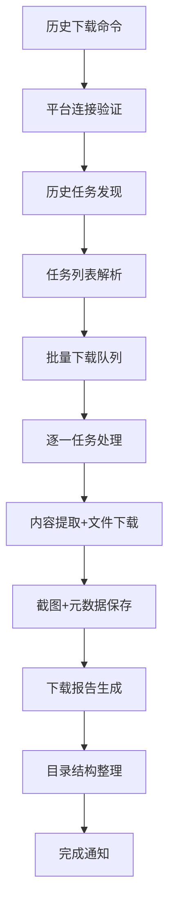

# AgentHub 项目概述

## 项目简介

AgentHub 是一个企业级的多平台 AI 代理服务自动化平台，旨在通过智能化的浏览器操作技术，实现AI平台的统一管理、批量任务处理和完整数据备份。项目从简单的任务调度工具演进为具备智能分析、历史数据管理等高级功能的企业级平台。

## 核心功能矩阵

### 🤖 智能浏览器引擎 (Core Engine)
| 功能模块 | 描述 | 技术特点 |
|---------|-----|---------|
| **页面智能分析** | 自动识别页面结构和交互元素 | 多选择器策略、DOM分析 |
| **置信度评分系统** | 多维度评估操作可靠性 | 可见性+特异性+文本相关性 |
| **自适应操作机制** | 根据页面变化动态调整策略 | 智能降级、自动重试 |
| **容错恢复处理** | 网络异常、页面变更自动处理 | 异常捕获、状态恢复 |
| **操作历史追踪** | 完整记录浏览器操作历史 | 状态快照、操作链路 |

### 📚 历史任务管理 (History Management)
| 功能模块 | 描述 | 文件格式 |
|---------|-----|---------|
| **智能任务发现** | 自动识别平台历史任务列表 | - |
| **批量数据下载** | 一键下载所有历史对话 | - |
| **多格式备份** | 完整数据备份和归档 | TXT, PNG, HTML, JSON |
| **附件文件处理** | 下载各种格式的附件文件 | PDF, DOCX, XLSX等 |
| **详细报告生成** | 下载统计和错误分析 | JSON报告 |

### 🌐 平台适配层 (Platform Adapters)
| 平台 | 状态 | 支持功能 |
|------|-----|---------|
| **Skywork** | ✅ 完整支持 | 任务提交、结果获取、历史下载 |
| **Manus** | ✅ 完整支持 | 研究分析、深度调研、数据导出 |
| **ChatGPT** | 🚧 开发中 | API集成、对话管理 |
| **扣子空间** | 📋 计划中 | 平台适配、功能对接 |

### 📅 任务调度系统 (Scheduler)
| 功能 | 描述 | 配置方式 |
|------|-----|---------|
| **定时任务执行** | 支持cron表达式和自定义调度 | YAML配置 |
| **动态命题生成** | AI驱动的任务内容生成 | API调用 |
| **资源智能分配** | 平台额度监控和负载均衡 | 配置策略 |
| **批量任务处理** | 支持大规模并发执行 | 队列管理 |

## 技术架构深度解析

### 🏗️ 系统架构图

```
┌─────────────────────────────────────────────────────────────────┐
│                         AgentHub                              │
├─────────────────────────────────────────────────────────────────┤
│  CLI Interface │ Web API │ Background Scheduler │ Monitoring     │
├─────────────────────────────────────────────────────────────────┤
│                    核心业务层 (Core Layer)                      │
│  ┌─────────────────┐ ┌─────────────────┐ ┌─────────────────┐   │
│  │ Enhanced        │ │ History         │ │ Task            │   │
│  │ Browser Engine  │ │ Downloader      │ │ Executor        │   │
│  └─────────────────┘ └─────────────────┘ └─────────────────┘   │
├─────────────────────────────────────────────────────────────────┤
│                   平台适配层 (Platform Layer)                   │
│  ┌─────────────────┐ ┌─────────────────┐ ┌─────────────────┐   │
│  │ Skywork         │ │ Manus           │ │ ChatGPT         │   │
│  │ Platform        │ │ Platform        │ │ Platform        │   │
│  └─────────────────┘ └─────────────────┘ └─────────────────┘   │
├─────────────────────────────────────────────────────────────────┤
│                    基础设施层 (Infrastructure)                  │
│  ┌─────────────────┐ ┌─────────────────┐ ┌─────────────────┐   │
│  │ Playwright      │ │ SQLite          │ │ File System     │   │
│  │ Browser         │ │ Database        │ │ Storage         │   │
│  └─────────────────┘ └─────────────────┘ └─────────────────┘   │
└─────────────────────────────────────────────────────────────────┘
```

### 🧠 增强版浏览器引擎架构

```python
EnhancedBrowserEngine
├── 页面状态管理 (Page State Management)
│   ├── 状态捕获 (State Capture)
│   ├── 变化检测 (Change Detection)
│   └── 历史回放 (History Replay)
├── 智能元素定位 (Smart Element Location)
│   ├── 多策略选择器 (Multi-Strategy Selectors)
│   ├── 置信度评分 (Confidence Scoring)
│   └── 动态适配 (Dynamic Adaptation)
├── 操作执行引擎 (Operation Engine)
│   ├── 智能输入 (Smart Input)
│   ├── 智能提交 (Smart Submit)
│   ├── 内容等待 (Content Wait)
│   └── 内容提取 (Content Extract)
└── 容错恢复系统 (Error Recovery)
    ├── 异常处理 (Exception Handling)
    ├── 重试机制 (Retry Logic)
    └── 降级策略 (Fallback Strategy)
```

### 📚 历史下载器架构

```python
HistoryDownloader
├── 任务发现引擎 (Task Discovery)
│   ├── 侧边栏识别 (Sidebar Detection)
│   ├── 任务项解析 (Task Item Parsing)
│   └── 元数据提取 (Metadata Extraction)
├── 批量下载引擎 (Batch Download)
│   ├── 任务队列管理 (Task Queue)
│   ├── 并发控制 (Concurrency Control)
│   └── 进度监控 (Progress Monitoring)
├── 数据处理引擎 (Data Processing)
│   ├── 内容提取 (Content Extraction)
│   ├── 文件下载 (File Download)
│   ├── 截图保存 (Screenshot Capture)
│   └── 元数据生成 (Metadata Generation)
└── 报告生成器 (Report Generator)
    ├── 统计分析 (Statistics Analysis)
    ├── 错误汇总 (Error Summary)
    └── 成功率计算 (Success Rate Calculation)
```

## 数据流架构

### 📊 任务执行数据流



### 📥 历史下载数据流



## 文件系统架构

### 📁 项目目录结构

```
AgentHub/
├── 📂 app/                          # 应用程序核心
│   ├── 📂 core/                    # 核心业务逻辑
│   │   ├── 🤖 browser_engine.py   # 增强版浏览器引擎
│   │   ├── 📥 history_downloader.py # 历史任务下载器
│   │   ├── ⚡ task_executor.py     # 任务执行器
│   │   ├── 📝 logger.py            # 结构化日志系统
│   │   └── ⚠️ exceptions.py        # 自定义异常类
│   ├── 📂 platforms/               # 平台适配器
│   │   ├── 🏗️ enhanced_platform_base.py # 增强版基类
│   │   ├── 🌟 skywork.py          # Skywork平台适配
│   │   └── 🔬 manus.py            # Manus平台适配
│   ├── 📂 scheduler/               # 任务调度系统
│   ├── 📂 storage/                 # 数据存储层
│   ├── 📂 config/                  # 配置管理
│   ├── 📂 utils/                   # 工具函数库
│   └── 📂 api/                     # Web API服务
├── 📂 scripts/                     # 开发和运维脚本
│   ├── 🚀 start_chrome_debug.py   # Chrome调试启动
│   ├── 🔍 inspect_page.py         # 页面结构分析
│   └── 🧪 test_history_discovery.py # 历史任务发现测试
├── 📂 tests/                       # 测试用例
│   ├── 📂 unit/                   # 单元测试
│   └── 📂 integration/            # 集成测试
├── 📂 docs/                        # 项目文档
│   ├── 📖 history_download_guide.md # 历史下载指南
│   ├── 📋 project_rules_updated.md # 项目规则
│   └── 📄 project_overview.md     # 项目概述
├── 📂 configs/                     # 配置文件
├── 📂 data/                        # 数据目录
│   ├── 📥 downloads/              # 历史下载数据
│   ├── 📊 results/                # 任务执行结果
│   └── 📝 logs/                   # 运行日志
└── 🐳 docker-compose.yml          # Docker编排配置
```

### 💾 数据存储架构

```
data/
├── downloads/                      # 历史任务下载存储
│   └── {platform}_history_{timestamp}/
│       ├── task_{unique_id}/       # 单个任务目录
│       │   ├── content.txt         # 📄 主要文本内容
│       │   ├── screenshot.png      # 📸 页面截图
│       │   ├── page.html          # 🌐 HTML源码
│       │   ├── metadata.json      # 📊 任务元数据
│       │   └── attachments/       # 📎 附件文件夹
│       │       ├── document.pdf   # PDF文档
│       │       ├── report.docx     # Word文档
│       │       └── data.xlsx       # Excel表格
│       └── download_report.json   # 📋 下载总报告
├── results/                        # 任务执行结果
│   └── {task_type}_{timestamp}/
├── logs/                          # 运行日志
│   ├── app.log                    # 应用主日志
│   ├── browser.log                # 浏览器操作日志
│   └── error.log                  # 错误日志
└── temp/                          # 临时文件
    ├── screenshots/               # 临时截图
    └── downloads/                 # 临时下载
```

## 关键技术创新

### 🧠 智能置信度评分算法

```python
def calculate_element_confidence(element, selector, element_type):
    """
    多维度置信度评分算法
    
    评分维度：
    1. 可见性权重 (30%)
    2. 选择器特异性 (30%)
    3. 文本相关性 (25%)
    4. 属性匹配度 (15%)
    """
    confidence = 0.0
    
    # 可见性评分
    if is_visible(element):
        confidence += 0.3
    
    # 选择器特异性评分
    if "#" in selector:          # ID选择器最高
        confidence += 0.3
    elif "." in selector:        # Class选择器中等
        confidence += 0.2
    elif "[" in selector:        # 属性选择器较低
        confidence += 0.2
    
    # 文本相关性评分
    text_relevance = calculate_text_relevance(element.text, element_type)
    confidence += text_relevance * 0.25
    
    # 属性匹配度评分
    attribute_match = calculate_attribute_match(element.attributes, element_type)
    confidence += attribute_match * 0.15
    
    return min(confidence, 1.0)
```

### 🔄 自适应操作机制

```python
class AdaptiveOperationStrategy:
    """自适应操作策略"""
    
    async def execute_with_adaptation(self, operation_type: str):
        """带自适应能力的操作执行"""
        
        # 1. 分析当前页面状态
        page_analysis = await self.analyze_page_intelligence()
        
        # 2. 选择最佳操作策略
        strategy = self.select_best_strategy(page_analysis, operation_type)
        
        # 3. 执行操作并监控结果
        for attempt in range(self.max_retries):
            try:
                result = await self.execute_strategy(strategy)
                if result.success:
                    return result
                
                # 4. 根据失败原因调整策略
                strategy = self.adapt_strategy(strategy, result.error)
                
            except Exception as e:
                # 5. 异常情况下的降级处理
                strategy = self.fallback_strategy(strategy, e)
        
        return self.final_fallback()
```

### 📊 数据完整性保障

```python
class DataIntegrityManager:
    """数据完整性管理器"""
    
    async def ensure_complete_backup(self, task: HistoryTask):
        """确保完整的数据备份"""
        
        backup_items = {
            "content": await self.extract_text_content(task),
            "screenshot": await self.capture_screenshot(task),
            "html": await self.save_html_source(task),
            "metadata": await self.generate_metadata(task),
            "attachments": await self.download_attachments(task)
        }
        
        # 验证备份完整性
        integrity_check = await self.verify_backup_integrity(backup_items)
        
        if not integrity_check.complete:
            # 尝试补充缺失的数据
            missing_items = integrity_check.missing_items
            for item in missing_items:
                backup_items[item] = await self.retry_backup_item(task, item)
        
        return backup_items
```

## 性能优化策略

### ⚡ 并发处理架构

```python
class ConcurrentProcessingManager:
    """并发处理管理器"""
    
    def __init__(self, max_concurrent: int = 5):
        self.semaphore = asyncio.Semaphore(max_concurrent)
        self.task_queue = asyncio.Queue()
        self.result_collector = []
    
    async def process_batch_tasks(self, tasks: List[Task]):
        """批量并发处理任务"""
        
        # 创建工作协程
        workers = [
            self.worker(worker_id) 
            for worker_id in range(self.max_concurrent)
        ]
        
        # 将任务加入队列
        for task in tasks:
            await self.task_queue.put(task)
        
        # 启动并发处理
        await asyncio.gather(*workers)
        
        return self.result_collector
```

### 💾 智能缓存系统

```python
class IntelligentCacheSystem:
    """智能缓存系统"""
    
    def __init__(self):
        self.page_cache = LRUCache(maxsize=100)
        self.element_cache = LRUCache(maxsize=1000)
        self.confidence_cache = LRUCache(maxsize=5000)
    
    async def get_cached_page_analysis(self, page_hash: str):
        """获取缓存的页面分析结果"""
        if page_hash in self.page_cache:
            return self.page_cache[page_hash]
        
        # 缓存未命中，执行分析并缓存
        analysis = await self.perform_page_analysis()
        self.page_cache[page_hash] = analysis
        return analysis
```

## 监控和可观测性

### 📊 指标监控体系

```python
class MetricsCollector:
    """指标收集器"""
    
    def __init__(self):
        self.counters = {
            "tasks_executed": Counter(),
            "downloads_completed": Counter(),
            "errors_occurred": Counter()
        }
        
        self.histograms = {
            "task_duration": Histogram(),
            "download_size": Histogram(),
            "confidence_scores": Histogram()
        }
        
        self.gauges = {
            "active_connections": Gauge(),
            "memory_usage": Gauge(),
            "cache_hit_rate": Gauge()
        }
    
    async def collect_metrics(self):
        """收集系统指标"""
        return {
            "counters": {k: v.value for k, v in self.counters.items()},
            "histograms": {k: v.summary() for k, v in self.histograms.items()},
            "gauges": {k: v.value for k, v in self.gauges.items()}
        }
```

### 🔍 分布式追踪

```python
class DistributedTracing:
    """分布式追踪系统"""
    
    async def trace_operation(self, operation_name: str, **kwargs):
        """追踪操作执行链路"""
        
        trace_id = self.generate_trace_id()
        span_id = self.generate_span_id()
        
        with self.create_span(trace_id, span_id, operation_name) as span:
            span.set_attributes(kwargs)
            
            try:
                result = await self.execute_operation(**kwargs)
                span.set_status("SUCCESS")
                return result
            except Exception as e:
                span.set_status("ERROR", str(e))
                span.record_exception(e)
                raise
```

## 安全和合规

### 🔒 数据安全架构

```python
class SecurityManager:
    """安全管理器"""
    
    def __init__(self):
        self.encryption_key = self.load_encryption_key()
        self.access_control = RoleBasedAccessControl()
        self.audit_logger = AuditLogger()
    
    async def encrypt_sensitive_data(self, data: dict) -> dict:
        """加密敏感数据"""
        sensitive_fields = ["password", "api_key", "token"]
        
        for field in sensitive_fields:
            if field in data:
                data[field] = self.encrypt(data[field])
        
        return data
    
    async def audit_operation(self, user: str, operation: str, details: dict):
        """审计操作记录"""
        audit_record = {
            "timestamp": datetime.utcnow(),
            "user": user,
            "operation": operation,
            "details": self.sanitize_details(details),
            "ip_address": self.get_client_ip(),
            "user_agent": self.get_user_agent()
        }
        
        await self.audit_logger.log(audit_record)
```

### 🛡️ 隐私保护机制

```python
class PrivacyProtectionManager:
    """隐私保护管理器"""
    
    def __init__(self):
        self.pii_detector = PIIDetector()
        self.data_anonymizer = DataAnonymizer()
    
    async def sanitize_content(self, content: str) -> str:
        """内容隐私清理"""
        
        # 检测个人信息
        pii_items = self.pii_detector.detect(content)
        
        # 匿名化处理
        for pii_item in pii_items:
            content = self.data_anonymizer.anonymize(content, pii_item)
        
        return content
    
    async def comply_with_gdpr(self, user_data: dict) -> dict:
        """GDPR合规处理"""
        
        # 数据最小化
        essential_data = self.minimize_data(user_data)
        
        # 用户同意验证
        if not self.verify_user_consent(essential_data):
            raise PrivacyViolationError("用户未同意数据处理")
        
        return essential_data
```

## 未来发展路线图

### 🎯 短期目标 (Q3 2024)

1. **平台扩展**
   - 支持ChatGPT DeepSearch平台
   - 集成Claude和Gemini平台
   - 扩展API集成能力

2. **功能增强**
   - 实时任务监控仪表板
   - 高级数据分析和可视化
   - 移动端适配支持

3. **性能优化**
   - 分布式任务处理
   - 缓存策略优化
   - 资源使用效率提升

### 🚀 长期愿景 (2025)

1. **企业级功能**
   - 多租户管理系统
   - 企业级SSO集成
   - 高级权限控制

2. **AI驱动优化**
   - 机器学习驱动的操作优化
   - 智能异常预测和处理
   - 自动化性能调优

3. **生态系统建设**
   - 插件市场和开发者生态
   - 第三方集成SDK
   - 社区驱动的平台适配器

## 总结

AgentHub 项目通过创新的智能浏览器引擎和历史任务管理系统，为AI平台的自动化操作提供了完整的解决方案。项目不仅实现了基础的任务调度功能，更通过智能分析、自适应操作、完整备份等高级特性，为用户提供了企业级的自动化体验。

随着AI技术的快速发展和企业数字化需求的增长，AgentHub 将持续演进，成为连接用户与AI平台的重要桥梁，助力用户更高效地利用AI技术的强大能力。 