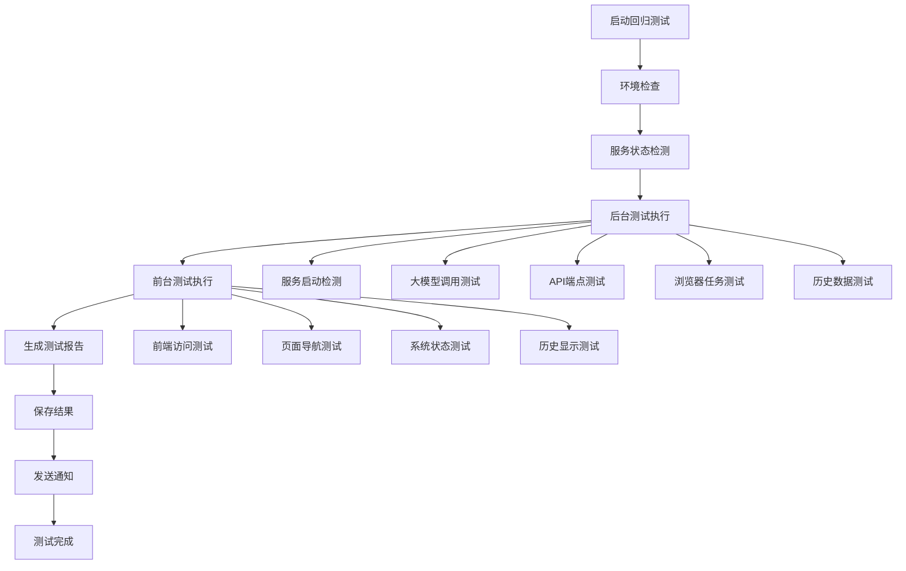

# AgentHub 回归测试系统

## 📋 系统概述

AgentHub回归测试系统是一个全面的自动化测试框架，旨在确保系统在任何代码变更后都能保持稳定运行。该系统支持后台和前台的全方位测试，并具备自动扩展能力。

## 🎯 测试目标

### 核心目标
- **保证系统基本功能正常运作**
- **及早发现代码变更引入的问题**
- **提供持续的系统健康监控**
- **确保AI编程的质量和效率**

### 测试范围
1. **后台服务测试**
   - API服务启动和健康检查
   - 大模型调用功能验证
   - 核心API端点响应测试
   - 浏览器自动化功能测试
   - 历史任务和文件访问测试

2. **前台应用测试**
   - 前端应用可访问性
   - 页面导航功能
   - 系统状态显示
   - 历史任务显示功能

## 🛠️ 系统架构

### 核心组件

```
regression_test.py                    # 主测试执行器
├── AgentHubRegressionTest           # 测试控制器
├── TestResult                       # 测试结果数据结构
└── 测试方法集合
    ├── _run_backend_tests()         # 后台测试集
    ├── _run_frontend_tests()        # 前台测试集
    └── _generate_test_report()      # 报告生成器

configs/regression_test_config.yaml  # 测试配置文件
├── backend_tests                    # 后台测试配置
├── frontend_tests                   # 前台测试配置
├── auto_extension_rules            # 自动扩展规则
└── reporting                       # 报告配置

scripts/run_regression_test.sh      # 运行包装脚本
├── 环境检查
├── 服务状态检测
├── 测试执行
└── 结果汇总
```

### 测试流程



## 🚀 使用方法

### 基本使用

```bash
# 直接运行Python脚本
python regression_test.py

# 使用包装脚本（推荐）
./scripts/run_regression_test.sh

# 查看帮助
./scripts/run_regression_test.sh --help
```

### 高级使用

```bash
# 不同模式执行
./scripts/run_regression_test.sh manual     # 手动模式
./scripts/run_regression_test.sh scheduled # 定时模式
./scripts/run_regression_test.sh ci        # CI/CD模式
```

### 前置条件

确保以下服务正在运行：
1. **API服务**: `python main.py serve` (端口8000)
2. **前端服务**: `cd frontend && npm run dev` (端口3001)
3. **Chrome调试会话**: 启动Chrome调试模式 (端口9222)

```bash
# 启动Chrome调试会话
/Applications/Google\ Chrome.app/Contents/MacOS/Google\ Chrome \
  --remote-debugging-port=9222 \
  --no-first-run \
  --no-default-browser-check &
```

## 📊 测试结果解读

### 成功率标准
- **🎉 优秀**: 成功率 ≥ 90%
- **⚠️ 良好**: 成功率 ≥ 70%
- **🚨 需要关注**: 成功率 < 70%

### 测试报告结构

```json
{
  "timestamp": "2025-06-01T19:32:15.690688",
  "summary": {
    "total_tests": 11,
    "successful_tests": 11,
    "failed_tests": 0,
    "success_rate": 1.0,
    "total_duration": 7.71
  },
  "categories": {
    "backend": {"total": 7, "successful": 7, "failed": 0},
    "frontend": {"total": 4, "successful": 4, "failed": 0}
  },
  "test_results": [...],  // 详细测试结果
  "failed_tests": [...]   // 失败测试详情
}
```

### 测试报告存储

- **详细报告**: `data/regression_tests/regression_test_YYYYMMDD_HHMMSS.json`
- **最新结果**: `data/regression_tests/latest_result.json`
- **保留期限**: 30天（可配置）

## 🔄 自动扩展功能

### 扩展规则

回归测试系统具备智能扩展能力，会自动检测以下新增功能并添加对应测试：

1. **API端点检测**
   ```python
   # 扫描模式
   @router.get("/api/v1/new_endpoint")
   # → 自动添加端点响应测试
   ```

2. **AI功能检测**
   ```python
   # 扫描模式
   async def new_ai_function(...) -> ModelResponse:
   # → 自动添加AI功能测试
   ```

3. **浏览器功能检测**
   ```python
   # 扫描模式
   async def smart_new_operation(...)
   async def ai_enhanced_feature(...)
   # → 自动添加浏览器操作测试
   ```

4. **平台集成检测**
   ```python
   # 扫描模式
   class NewPlatform(BasePlatform):
   # → 自动添加平台连接测试
   ```

### 扩展配置

在 `configs/regression_test_config.yaml` 中配置自动扩展规则：

```yaml
auto_extension_rules:
  api_endpoint_detection:
    enabled: true
    scan_paths: ["app/api"]
    pattern: "@router\\.(get|post|put|delete)\\(['\"]([^'\"]+)['\"]"
    auto_add_basic_test: true
```

## 📅 定时执行

### 定时任务配置

```bash
# 添加到crontab
crontab -e

# 每天8点和20点执行
0 8,20 * * * cd /path/to/AgentHub && ./scripts/run_regression_test.sh scheduled
```

### 触发条件

- **Git推送后**: 使用Git hooks触发
- **部署时**: CI/CD流水线集成
- **手动执行**: 开发过程中主动运行
- **定时执行**: 系统定期健康检查

## 🔧 故障排除

### 常见问题

1. **API服务未启动**
   ```bash
   # 解决方案
   python main.py serve &
   ```

2. **Chrome调试会话不可用**
   ```bash
   # 解决方案
   /Applications/Google\ Chrome.app/Contents/MacOS/Google\ Chrome \
     --remote-debugging-port=9222 --no-first-run &
   ```

3. **大模型调用失败**
   ```bash
   # 检查API密钥
   export MODEL_GEMINI_API_KEY="your_api_key"
   ```

4. **前端服务不可访问**
   ```bash
   # 启动前端服务
   cd frontend && npm run dev
   ```

### 调试模式

```bash
# 启用详细日志
PYTHONPATH=. python regression_test.py --verbose

# 只运行特定类别的测试
PYTHONPATH=. python regression_test.py --category backend
PYTHONPATH=. python regression_test.py --category frontend
```

## 📈 性能监控

### 关键指标

- **执行时间**: 通常 < 10秒
- **成功率**: 目标 > 90%
- **覆盖范围**: 11个核心测试项
- **资源消耗**: 低内存和CPU占用

### 性能优化

1. **并发执行**: 独立测试项并行运行
2. **缓存机制**: 复用浏览器会话
3. **智能跳过**: 依赖服务不可用时跳过相关测试
4. **资源清理**: 自动清理临时资源

## 🚨 最佳实践

### 开发者指南

1. **每次代码变更后立即运行回归测试**
   ```bash
   # 开发流程
   git add .
   ./scripts/run_regression_test.sh  # 确保测试通过
   git commit -m "feature: 新功能实现"
   ```

2. **新功能开发时同步添加测试**
   - 更新 `configs/regression_test_config.yaml`
   - 添加对应的测试逻辑
   - 验证测试覆盖完整性

3. **测试失败时的处理流程**
   - 不要忽略测试失败
   - 仔细分析失败原因
   - 修复问题后重新运行
   - 确保通过后再提交代码

### CI/CD集成

```yaml
# GitHub Actions 示例
name: Regression Tests
on: [push, pull_request]

jobs:
  test:
    runs-on: ubuntu-latest
    steps:
      - uses: actions/checkout@v2
      - name: Run Regression Tests
        run: |
          ./scripts/run_regression_test.sh ci
          if [ $? -ne 0 ]; then
            echo "回归测试失败，阻止合并"
            exit 1
          fi
```

## 📚 相关文档

- [项目开发规范](../需求.md#开发规范)
- [API文档](api.md)
- [浏览器自动化指南](browser_automation.md)
- [AI集成文档](ai_integration.md)

## 🔄 版本历史

- **v1.0**: 基础回归测试框架
- **v1.1**: 添加AI功能测试
- **v1.2**: 增加浏览器自动化测试
- **v2.0**: 完整的自动扩展系统
- **v2.1**: 定时执行和CI/CD集成

---

**重要提醒**: 回归测试是确保AgentHub系统稳定性的关键工具。每个开发者都应该熟悉其使用方法，并严格遵循"测试先行"的开发原则。 